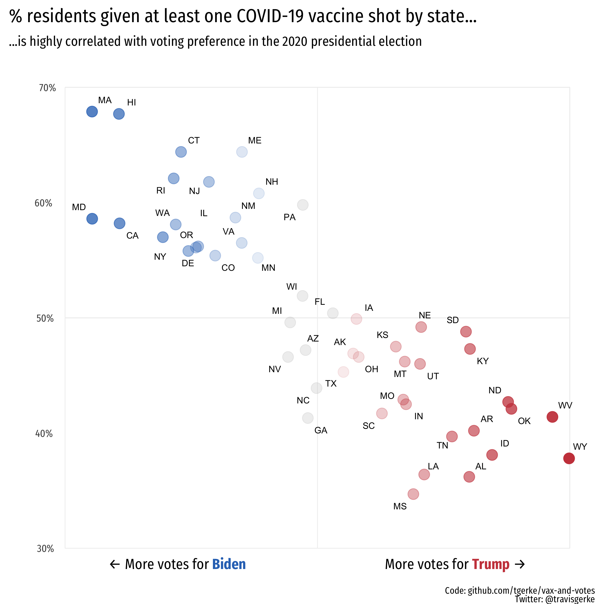

Vaccine uptake and vote shares in the 2020 presidential election
=====================
  
Vaccine data from [CDC](https://covid.cdc.gov/covid-data-tracker/#vaccinations), and 2020 voting data from [Wikipedia](https://en.wikipedia.org/wiki/2020_United_States_presidential_election).

Motivation for plot styling and format from [NYT](https://www.nytimes.com/interactive/2021/04/17/us/vaccine-hesitancy-politics.html).

